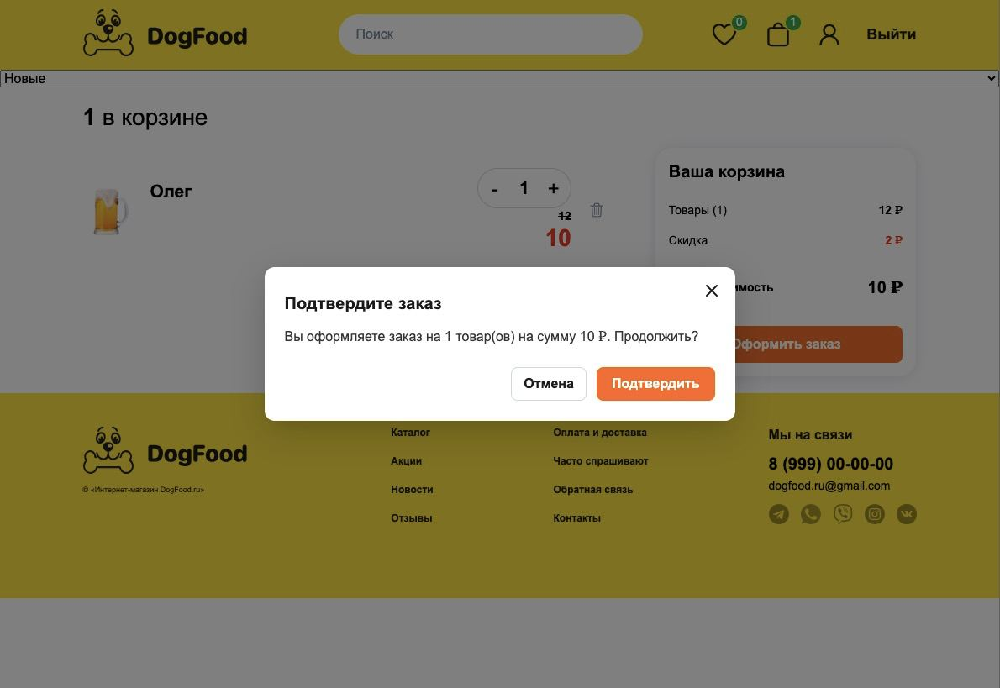
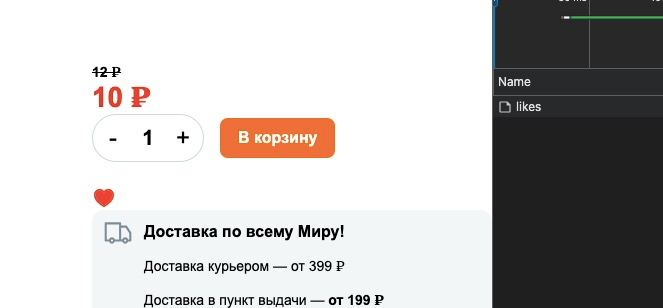
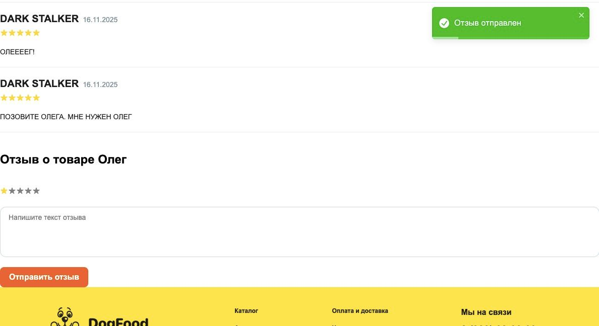

# React Pro — финальный проект

Магазин на React 19 + Redux Toolkit (RTK Query). Сборка — Vite + SWC, архитектура — FSD.

## Запуск

```bash
npm i
npm run start    # dev на http://localhost:3000
npm run build    # прод-сборка в ./dist
npm run preview  # локальный preview сборки
```

В `.env` лежит `API_URL` бэкенда — Vite пробрасывает его в код через `define`, чтобы не переписывать существующий `process.env.API_URL`.

---

## Что сделано

1. **FSD-архитектура.** `app → pages → widgets → features → shared`. Все cross-slice импорты идут через alias `@/*`. В `shared/ui` остались только презентационные примитивы (`Button`, `Input`, `Loader`, `Modal`, `Logo`, `Rating`, `ButtonBack`, `Spinner`, `WithQuery`).
2. **Убраны prop-drilling-цепочки.** Селекторы `cartSelectors.getCartProductsCount`, `selectIsProductInCart`, `selectCartProductById`, `useLikedCount` подписывают компоненты ровно на тот примитив, который им нужен. `Header` больше не считает количество избранного из массива товаров.
3. **Оптимизация рендеров.** `React.memo`, `useMemo`, `useCallback` на списках и листьях. `Header` разбит на три мемо-компонента (`FavoritesBadge`, `CartBadge`, `UserMenu`) — основная шапка не ререндерится при изменении корзины/лайков. Все страницы подключены через `React.lazy` + `Suspense`.
4. **Modal через `React.Portal`.** В `index.html` добавлен `<div id="modal-root">`. `shared/ui/Modal` рендерит контент туда, закрывается по крестику, оверлею и `Esc`. Фокус ставится на крестик при открытии и возвращается на триггер при закрытии. На время открытия блокируется скролл `body`.
5. **`useRef` — реальное применение.** Автофокус email-инпута в формах входа/регистрации (`emailInputRef.current?.focus()`), плюс `submitAttemptsRef` и `mountedAtRef` для метрик попыток сабмита без лишних ререндеров. В `Modal` — `closeButtonRef` для автофокуса и `triggerRef` для возврата фокуса.
6. **React 19 хуки.**
   - `useOptimistic` для **добавления товара в избранное** (`LikeButton`): сердечко перекрашивается до ответа сервера, плюс оптимистичный патч кэша в `productsApi.onQueryStarted`, чтобы между концом транзакции и приходом ответа не было серой «вспышки».
   - `useActionState` для **формы комментария/отзыва** (`ReviewForm`): `isPending` берётся из третьего значения хука без локального `useState`, после `status: 'success'` форма автоматически сбрасывается через `formRef.current?.reset()`.
7. **Vite + SWC вместо webpack.** Webpack-конфиги, лоадеры и babel-стек удалены (`removed 463 packages`). Сборка ускорилась с ~70 с до ~5 с.

## Структура папок

```
src/
├── app/                  ← корневой App-компонент, провайдеры, глобальные стили
├── pages/                ← страницы-роуты (HomePage, CartPage, ProductPage, ProfilePage, …)
├── widgets/              ← композиционные блоки уровня страницы
│   ├── Header/           ← шапка + декомпозированные FavoritesBadge / CartBadge / UserMenu
│   └── Footer/
├── features/             ← бизнес-фичи, изолированные по доменам
│   ├── auth/             ← SignIn/SignUp формы, WithProtection, валидаторы
│   ├── cart/             ← CartCounter, AddToCartButton, useCartItem, useAddToCart
│   ├── products/         ← Card, CardList, LikeButton, Price, Sort, LoadMore, useProducts
│   ├── reviews/          ← ReviewForm (на useActionState), ReviewList
│   └── search/           ← Search + useProductsSearchForm
└── shared/               ← переиспользуемое, ничего не знающее про бизнес
    ├── ui/               ← Button, Input, Loader, Modal, Logo, Rating, WithQuery, …
    ├── store/            ← RTK store, slices (user, cart, products), RTK Query (authApi, productsApi)
    ├── providers/router/ ← createBrowserRouter + lazy-роуты
    ├── hooks/            ← useDebounce, usePagination
    ├── utils/            ← getMessageFromError, isLiked, общие утилиты
    ├── types/            ← глобальные типы домена (Product, Review, User, …)
    └── assets/           ← иконки и картинки
```

Правила:

- Импорты идут только «вниз» по слоям: `pages → features → shared` и т.п. Обратных импортов нет.
- В `shared/ui` запрещены обращения к стору и API.
- Cross-slice импорты — через `@/...`. Внутри одного слайса оставлены относительные `./Sibling`.

## Сравнение сборок

| Метрика | Webpack 5 + ts-loader | Vite 8 + SWC |
|---|---|---|
| Время сборки | ~70 с | **~5 с** (≈ 14× быстрее) |
| Размер `dist/` | 732 KB | 736 KB |
| Сумма JS + CSS | 720 KB | 732 KB |
| Самый большой entry-чанк | ~430 KB (gzip 145 KB) | ~215 KB (gzip 70 KB) |
| Кол-во чанков | 1 main + 7 lazy | 1 entry + ~14 lazy |
| Транспайлер TS/TSX | `ts-loader` (single-thread) | `@swc/core` (Rust) |

## Демонстрация

Скриншоты — в папке `docs/`.

### Modal через Portal

Заказ из корзины подтверждается модалкой. Закрывается крестиком, кликом по подложке и `Esc`, фокус ловится корректно.



Код: `src/shared/ui/Modal/ui/Modal.tsx`, использование — `src/pages/CartPage/ui/CartAmount/ui/CartAmount.tsx`.

### Формы: `useActionState` + оптимистичный UI

**`useOptimistic` — добавление товара в избранное (`LikeButton`).** Сердечко на карточке переключается мгновенно по клику, не дожидаясь ответа сервера. Параллельно в `productsApi.onQueryStarted` сделан оптимистичный патч кэша `getProducts/getProduct`, чтобы между концом транзакции `useOptimistic` и приходом ответа не было «серой вспышки».



Код: `src/features/products/ui/LikeButton/LikeButton.tsx`, `src/shared/store/api/productsApi.ts`.

**`useActionState` — форма комментария/отзыва (`ReviewForm`).** Один хук возвращает `[state, formAction, isPending]`, который подключается к `<form action={formAction}>`. На submit:

- `isPending` идёт прямо в `loading` кнопки и `disabled` инпута — без отдельного `useState`;
- при `status: 'error'` под формой выводится сообщение из `state.error`, поля не теряются;
- при `status: 'success'` форма сбрасывается через `formRef.current?.reset()` + сбрасывается локальный `rating`.



Код: `src/features/reviews/ui/ReviewForm/ReviewForm.tsx`.

**Подвох с `useOptimistic` + RTK Query.** Чистого `useOptimistic` мало: он держит оптимистичное значение только пока активна транзакция. Когда мутация резолвится, транзакция заканчивается, а base-значение из RTK Query ещё не пришло (рефетч идёт отдельно по тегам) — получается мерцание «красное → серое → красное». Решено двумя слоями: `useOptimistic` для мгновенного UI, плюс `productsApi.util.updateQueryData` в `onQueryStarted`, который синхронно патчит кэш `getProducts/getProduct` в момент клика и откатывается через `patch.undo()` при ошибке.

### Оптимизация рендеров

Hotspot нашёл через React DevTools Profiler на сценарии «логин → главная → подгрузка следующей пачки товаров через LoadMore».

| Сценарий | До | После |
|---|---|---|
| Подгрузка пачки товаров | render **113.9 ms**, причина: `Header, LoadMore, Anonymous` | render **142.8 ms** на бóльшей пачке, причина: `FavoritesBadge, LoadMore, Anonymous` (Header из цепочки ушёл) |
| Открытие логина (MUI TouchRipple) | render 6.2 ms | render 4.8 ms |

Главное — `Header` пропал из цепочки. Подписка на `useLikedCount` локализована в листовом `FavoritesBadge`, шапка целиком больше не пересобирается.

Что конкретно сделано:

- `Header` разбит на `FavoritesBadge` / `CartBadge` / `UserMenu` — каждый подписан только на свой селектор.
- `Card`, `LikeButton`, `Price`, `CartItem`, `CartCounter` обёрнуты в `React.memo`.
- Селекторы возвращают примитивы (`getCartProductsCount`, `selectIsProductInCart`), а не массивы.
- Все страницы — через `React.lazy` + `Suspense` с `Loader`.

---

## Стек

React 19.2, Redux Toolkit 2 + RTK Query, React Router 6, react-hook-form + yup, MUI 5, Vite 8, SWC, TypeScript 5, ESLint + Prettier (`semi: false`), stylelint, husky + lint-staged.
